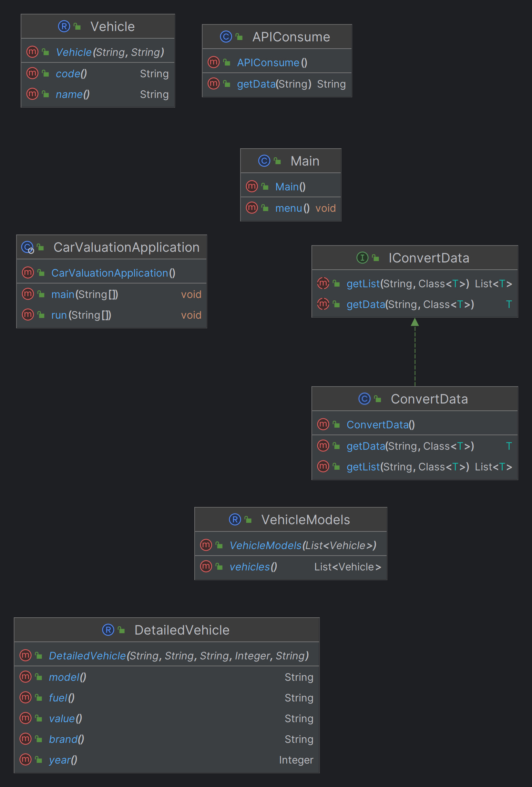
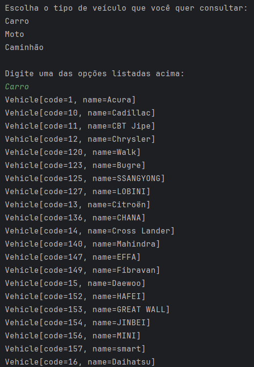
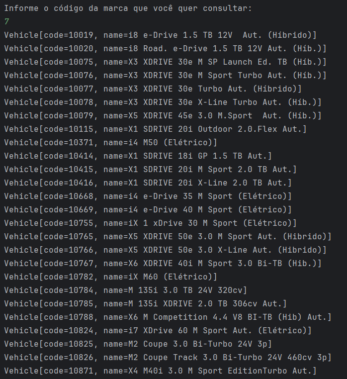
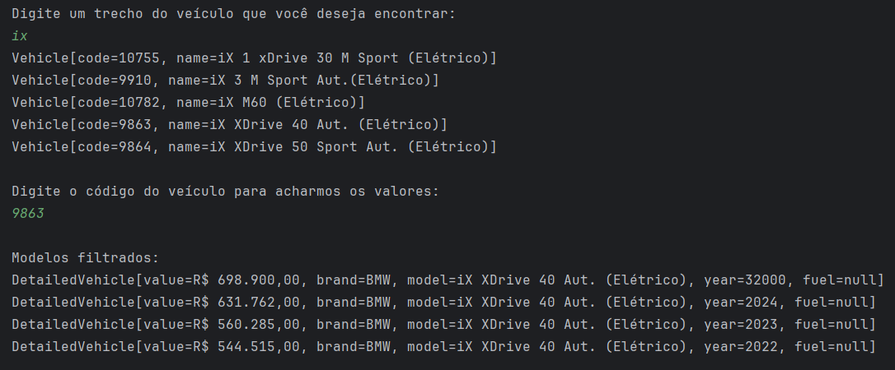

# Car Valuation
Esse repositório contém o desafio proposto durante os estudos sobre Lambda e Stream do Java no Spring Framework na plataforma de cursos da [Alura](https://www.alura.com.br/).

## Projeto
O Car Valuation é uma aplicação que consome a API do [FIPE API HTTP REST](https://deividfortuna.github.io/fipe/) e faz diversas manipulações por meio da Stream API em cima das coleções da Collection Framework do Java. 
Dados são filtrados para retornar os valores de um modelo de veículos desejado pelo usuário.

## Estrutura
O projeto ficou estruturado da seguinte forma:

<p align="center">
   
</p>

- **CarValuationApplication:** Classe principal que faz o projeto rodar.
- **Main:** Classe auxliar com o contexto de menu do projeto.
- **Vehicle:** Classe modelo de veículos genéricos.
- **VehicleModels:** Classe modelo de modelos de veículos a partir do tipo de veículo escolhido.
- **DetailedVehicle:** Classe modelo de veículos com informações detalhadas.
- **IConvertData:** Interface com contrato de conversão de dados e listas.
- **ConvertData:** Classe auxiliar que implementa o contrato de conversão de dados e listas.
- **APIConsume:** Classe auxliar que consome um API qualquer (nesse caso, a **FIPE API**).

## Execução 
A seguir, um exemplo da execução do projeto:

<p align="center">
   
</p>
<p align="center">
   
</p>
<p align="center">
   
</p>

## Pré-requisitos para testar

De que coisas você precisa para instalar o software?
```
Java Development Kit 21
IDE com suporte para linguagem Java (ex. Intelijj IDEA)
Git/GitHub
```

## Instalação

Para fazer a instalação do ambiente de desenvolvimento em execução você deverá:
```
Instalar o Git
Baixar o projeto deste repositório ou cloná-lo em seu ambiente local
Instalar o JDK e setar as variáveis de ambiente
Instalar a IDE e abrir o projeto
Abrir o projeto na sua IDE
Executar o projeto na IDE
Testar o código pela linha de comando da IDE
```
